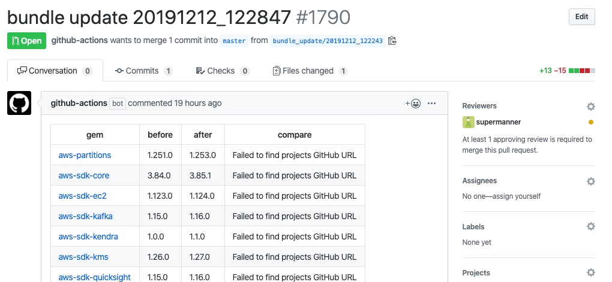

# Pull request on bundle update
This Github Action is that send pull request on bundle update.  
To draw bundle update diff table, I'd like use [bundler-diff](https://github.com/sinsoku/bundler-diff), Thank you.

This Github Action is running on **[ruby2.6-alipne](https://github.com/docker-library/ruby/blob/5c9e21cbf79b7f36d505555c9ecd62cf0f7e07f8/2.6/alpine3.10/Dockerfile)**.

## Usage
※ Without Gemfile and Gemfile.lock, this workflow is failure. 

```
name: pull request on bundle update
on:
  schedule:
    - cron: '*/15 * * * *'

jobs:
  bundle-update:
    name: bundle update
    runs-on: ubuntu-latest
    steps:
      - name: Checkout
        uses: actions/checkout@v1
        with:
          fetch-depth: 1
      - name: pull request on bundle update
        uses: supermanner/pull-request-on-bundle-update@v1.0.1
        with:
          github_token: ${{ secrets.GITHUB_TOKEN }}
          git_user_name: example_name
          git_email: test@example.com
          reviewers: supermanner,hoge,fuga // optional
          bundler_version: 2.0.1 // optional
```

## Demo


## Contributing
Bug reports and pull requests are welcome on GitHub at [pull-request-on-bundle-update](https://github.com/supermanner/pull-request-on-bundle-update).

## License
The plugin is available as open source under the terms of the [MIT License](https://opensource.org/licenses/MIT).
